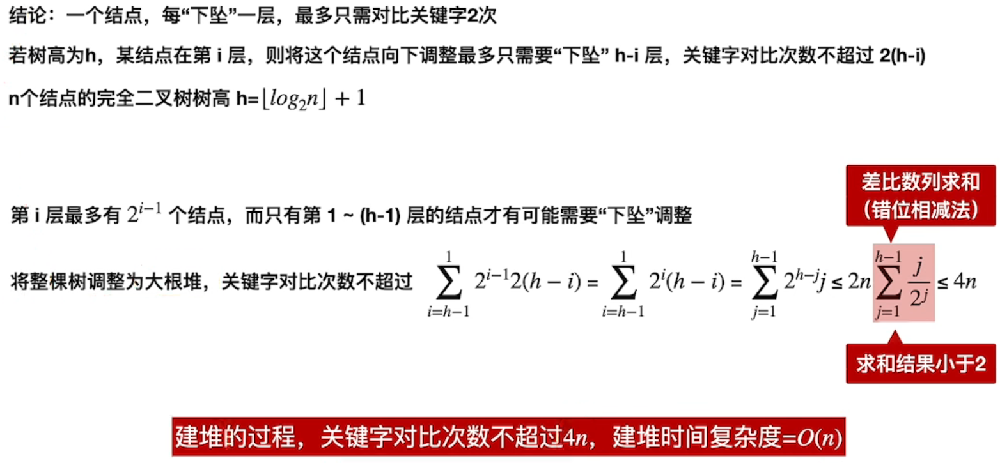
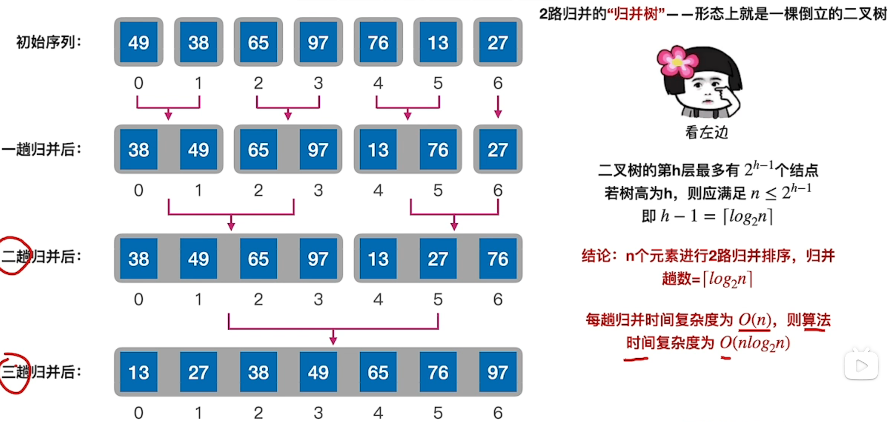

# 八大排序总结

## 插入排序 Insert Sort

### 1. 直接插入排序与折半插入排序

#### 1.1 思想

直接插入排序(Straight Insertion Sort)的基本思想是：

- 把n个待排序的元素看成为一个==有序表==和一个==无序表==。
- <u>开始时</u>有序表中只包含1个元素，无序表中包含有n-1个元素，
- 排序过程中每次<u>从无序表中取出**第一个元素**</u>，将它插入到有序表中的适当位置，使之成为新的有序表，重复n-1次可完成排序过程。

#### 1.2 复杂度

假设被排序的数列中有$N$个数。遍历一趟的时间复杂度是$O(N)$，需要遍历多少次呢? $N-1$次

每次遍历，

- 如果使用顺序查找，则总的时间复杂度是$O(N^2)$

- 如果使用二分查找，只考虑元素的<u>比较</u>而<u>不考虑移动</u>，平均时间复杂度确实是$O(Nlog_2N)$，
  但移动操作还是要考虑的，就算使用二分查找，==移动次数也未改变==，总的时间复杂度还是$O(N^2)$

  > 二分查找的平均时间复杂度是$O(log_2N)$

空间复杂度是$O(1)$

#### 1.3 稳定性

从无序表向有序表的插入本质上是通过**移动元素**完成的，
只要元素相等时停止移动，就**可以保证稳定性**

#### 1.4 代码实现

```java
void insertSort(int[] arr) {
  //从第二个元素开始向前插入
  for (int i = 1; i < arr.length; i++) {
    int temp = arr[i];//保存插入元素，防止移动时被覆盖
    int j;//借助j找到插入目标位置
    for (j = i - 1; j >= 0 && arr[j] > temp; j--) {
      arr[j + 1] = arr[j];//先统一向后移动
    }
    arr[j + 1] = temp;//再插入目标元素
  }
}
```

> 要插入谁？
>
> - 从第二个元素开始插入，先保存每次要插入的元素
>
> 插入的位置？
>
> - 左边相邻的元素依次右移，让出合适的位置

### 2. Shell插入排序

#### 2.1 思想

希尔排序实质上是一种**==分组插入==方法**。

怎么分组？
取一个小于n的整数gap（gap被称为步长，体现为**下标的差值**）将待排序元素分成若干个组子序列，下标表示为$i+k*gap$且$i$相同的元素放在同一个组中；

然后，对各组内的元素进行直接插入排序。 这一趟排序完成之后，每一个组的元素都是有序的。
再减小gap的值，并重复执行上述的分组和排序。

> gap的一系列取值称为**增量序列**，目前尚未有最佳方案，Shell提出的方法是从数组长度的一半开始，<u>每次减半</u>

重复这样的操作，当gap=1时，<u>再进行一次</u>插入排序，最后整个数列就是有序的。

为什么要这样做？
当==待排序列基本有序==时，直接插入排序的时间复杂度可以降低接近$O(n)$，所以思想就是，<u>先让序列变得基本有序，再进行一次高效的直接插入排序</u>

#### 2.2 复杂度

时间复杂度分析起来较困难，因为这还依赖于增量序列的选取

- 最坏情况下仍然是$O(n^2)$
- 当n在某个特定范围时，约为$O(n^{1.3})$
- Hibbard增量的希尔排序的时间复杂度为$O(N^{1.5})$

空间复杂度是$O(1)$

#### 2.3 稳定性

当相同关键字记录被<u>划分到不同分组时</u>，就有可能改变其相对次序

所以Shell排序是不稳定的

#### 2.4 代码实现

```java
void shellSort(int[] arr) {
  //步长取值放在外侧
  for (int gap = arr.length / 2; gap > 0; gap /= 2) {
    //循环取每组
    for (int i = 0; i < gap; i++) {
      //插入排序
      for (int j = i + gap; j < arr.length; j += gap) {
        int temp = arr[j];
        int k;
        for (k = j - gap; k >= 0 && arr[k] > temp; k -= gap) {
          arr[k + gap] = arr[k];
        }
        arr[k + gap] = temp;
      }
    }
  }
}
```

> 怎么分组？
>
> - 循环下标间距，再循环分组起始位置
>
> 分组之后做什么？
>
> - 插入排序

## 交换排序 Swap Sort

### 1. 冒泡排序 Bubble Sort

#### 1.1 思想

遍历若干次（最多是<u>数组长度减一次</u>）要排序的数列，
每次遍历时，它都会从前往后依次的比较相邻两个数的大小；
如果前者比后者大（升序），则交换它们的位置。

这样，一次遍历之后，最大的元素就在数列的末尾！ 
采用相同的方法再次遍历时，第二大的元素就被排列在最大元素之前。
重复此操作，直到整个数列都有序为止！

#### 1.2 复杂度

时间复杂度：考虑比较次数$\sum_{i=1}^{n-1}(n-i)$和移动次数$\sum_{i=1}^{n-1}3(n-i)$

- 最坏情况与平均情况时间复杂度都为$O(n^2)$

空间复杂度：$O(1)$

#### 1.3 稳定性

$a[i]=a[j]$时不发生交换，则算法**稳定**

#### 1.4 代码实现

```java
void bubbleSort(int[] arr) {
  //i代表本次冒泡的结束点
  for (int i = arr.length - 1; i > 0; i--) {
    boolean flag = false;
    //j从0开始冒泡到结束点，下标取到结束点前一个
    for (int j = 0; j < i; j++) {
      if (arr[j + 1] < arr[j]) {
        flag = true;
        arr[j + 1] ^= arr[j];
        arr[j] ^= arr[j + 1];
        arr[j + 1] ^= arr[j];
      }
    }
    if (!flag) {
      return;
    }
  }
}
```

> 冒泡冒到哪？
>
> - 右边最后一个元素，已经冒泡完的不算
>
> 从哪开始冒泡？
>
> - 从最左边开始，直到结束点的前一个

### 2. 快速排序 Quick Sort

#### 2.1 思想

选择一个**基准数**，通过一趟排序将要排序的数据分割成独立的两部分；<u>其中一部分的所有数据都比另外一部分的所有数据都要小</u>。然后，再按此方法对这两部分数据<u>分别进行快速排序</u>，整个排序过程可以递归进行，以此达到整个数据变成有序序列

#### 2.2 复杂度

时间复杂度：与划分点是否对称有关

- 最坏情况：$O(n^2)$

  > 可以通过一些手段，比如随机从表中选择枢轴元素，来增加对称性

- 平均情况：$O(nlog_2n)$

  > 快速排序是所有内部排序算法中平均性能最优的算法

空间复杂度：需要借助递归工作栈保留调用信息，所以由**调用次数**决定

- 最好与平均情况：$O(log_2n)$
- 最坏情况：$O(n)$

#### 2.3 稳定性

不稳定。

比如同一个划分区间中有两个相等的元素，它们被交换到另一个区间中后顺序就相反了

#### 2.4 代码实现

```java
private static void quickSort(int[] arr, int left, int right) {
  if (left >= right) {
    return;
  }
  int k = partition(arr, left, right);
  quickSort(arr, left, k - 1);
  quickSort(arr, k + 1, right);
}
private static int partition(int[] arr, int left, int right) {
  int pivot = arr[left];
  while (left < right) {
    //这里注意一定先遍历右边的，因为最开始左边先是空位
    while (left < right && arr[right] > pivot) {
      right--;
    }
    //这里先把交换动作完成了
    arr[left] = arr[right];
    while (left < right && arr[left] <= pivot) {
      left++;
    }
    arr[right] = arr[left];
  }
  //left==right时的位置一定是空位
  arr[left] = pivot;
  return left;
}
```

> 步骤？
>
> - （递归终点，）划分，递归，递归
>
> 怎么划分交换？
>
> - 选最左边为划分点，让出**空位**
> - 从右边开始扫描，找到需要交换的，然后立刻扔给空位，左边也是如此
> - 如果遇到相等，<u>把划分点给到空位</u>，结束

## 选择排序 Selection Sort

### 1. 简单选择排序

#### 1.1 思想

首先在未排序的数列中找到最小(or最大)元素，然后将其存放到<u>数列的起始位置</u>；

接着，再从剩余未排序的元素中继续寻找最小(or最大)元素，然后放到<u>已排序序列的末尾</u>。

以此类推，直到所有元素均排序完毕。

#### 1.2 复杂度

时间复杂度：

- 元素的移动次数很少，不超过 3 * (n - 1) 次
- 元素<u>**比较**次数固定</u>为$\frac{n(n-1)}2$次，因此时间复杂度为$O(n^2)$

空间复杂度：

- 仅用常数个辅助单元，$O(1)$

#### 1.3 稳定性

选择到最小元素后，会发生交换，可能导致两个相同元素相对次序发生改变

所以算法是不稳定的

#### 1.4 代码实现

```java
void selectionSort(int[] arr) {
  for (int i = 0; i < arr.length - 1; i++) {
    int min = i;
    for (int j = i + 1; j < arr.length; j++) {
      if (arr[min] > arr[j]) {
        min = j;
      }
    }
    if (min != i) {
      arr[min] ^= arr[i];
      arr[i] ^= arr[min];
      arr[min] ^= arr[i];
    }
  }
}
```

> 选了之后放哪？
>
> - 从下标为0的元素开始放，直到倒数第二个
>
> 怎么选？
>
> - 从要放的那个下标开始，直到结尾，比对并记录更小（大）的下标
> - 如果下标变了就交换

### 2. 堆排序 Heap Sort

#### 2.1 思想

> 本质上也是每次选出最大/小的，然后扔到数组最后面，
>
> 只不过选出最值的方式是通过堆

1. 初始化堆

   - 从最后一个非叶子节点开始，到第一个非叶子节点，**调整堆**

     1. 将要调整的非叶子节点值保存，并将该位置变成**空穴**

     2. 取最大的子节点值，与空穴值进行比较

        - 如果符合堆序，则结束

          > 这里可以直接结束是因为，根据调整堆的顺序，下面的一定都是调整好的

        - 如果不符合堆序，则空穴下滤，直到找到合适的位置

2. 交换数据，再以根为中心调整堆

#### 2.2 复杂度

时间复杂度：

- 建立堆为$O(n)$

  > 

- 选择排序时每次调整堆的时间复杂度为$O(h)$，共n-1次调整操作

- 总的时间复杂度为$O(nlog_2n)$

空间复杂度：

仅使用常数个辅助单元，空间复杂度为$O(1)$

#### 2.3 稳定性

和简单选择排序的道理一样，可能由于交换顺带把相同的两元素相对位置调换了，

所以是不稳定的

#### 2.4 代码实现

```java
public static void heapSort(int[] arr) {
  buildMaxHeap(arr);
  for (int i = arr.length - 1; i > 0; i--) {
    arr[0] ^= arr[i];
    arr[i] ^= arr[0];
    arr[0] ^= arr[i];
    adjustMaxHeap(arr, 0, i);
  }
}

public static void buildMaxHeap(int[] arr) {
  for (int i = arr.length / 2 - 1; i >= 0; i--) {
    adjustMaxHeap(arr, i, arr.length);
  }
}

//这个调整堆的方法是必须有长度这个参数的 len 就代表数组逻辑长度
private static void adjustMaxHeap(int[] arr, int k, int len) {
  //注意完全二叉树上的标号与数组下标的关系
  for (int i = 2 * (k + 1) - 1; i < len; i = 2 * (i + 1) - 1) {
    //注意这里的越界判断
    if (i + 1 < len && arr[i] < arr[i + 1]) {
      i++;
    }
    if (arr[i] <= arr[k]) {
      break;
    } else {
      arr[i] ^= arr[k];
      arr[k] ^= arr[i];
      arr[i] ^= arr[k];
      k = i;
    }
  }
}
```

> 步骤是什么？
>
> - 看上面的思想
>
> 怎么调整堆？
>
> - 注意数组下标与完全二叉树标号
> - 从**给定的调整中心**到**给定的长度**
>   1. 找“最”儿子
>   2. 根据**堆序**决定是否**下滤**

## 归并排序&基数排序 Merge Sort&Radix Sort	

### 1. 归并排序 Merge Sort

#### 1.1 思想

> 这里说的是“自顶向下”地归并

取一个划分点将数组划分为两部分，分别进行**归并排序**使之有序，再对两个有序数组进行**归并**；

归并的思想是，先将原数组要归并的值copy到新数组中，再将新数组归并到原数组

#### 1.2 复杂度

时间复杂度：

- 共$\lceil log_2n\rceil$趟归并，一趟归并会涉及到所有元素

  > 对“趟”的理解：
  >
  > 
  >
  > “趟”不是指调用`merge`函数的次数，而是从**归并树**的角度来看，同一层的调用`merge`看作是一趟归并

- 总的时间复杂度为：$O(nlog_2n)$

空间效率：

- 辅助数组$O(n)$

#### 1.3 稳定性

在`merge`函数中保证等于的时候是低位的先被归并进去，就不会改变相等元素的相对次序，

所以可以保证稳定性

#### 1.4 代码实现

```java
public class MergeSort {
  private static int[] copy;
  public static void mergeSort(int[] arr) {
    copy = new int[arr.length];
    mergeSort(arr, 0, arr.length);
  }
  //[low, high)
  private static void mergeSort(int[] arr, int low, int high) {
    if (high - low > 1) {
      int mid = (low + high) / 2;
      mergeSort(arr, low, mid);
      mergeSort(arr, mid, high);
      merge(arr, low, mid, high);
    }
  }
  private static void merge(int[] arr, int low, int mid, int high) {
    System.arraycopy(arr, low, copy, low, high - low);
    int i, j, k;
    for (i = low, j = mid, k = low; i < mid && j < high; k++) {
      if (copy[i] <= copy[j]) {
        arr[k] = copy[i++];
      } else {
        arr[k] = copy[j++];
      }
    }
    while (i < mid) {
      arr[k++] = copy[i++];
    }
    while (j < high) {
      arr[k++] = copy[j++];
    }
  }
}
```

> 步骤是什么
>
> - （递归出口）划分点、左闭右开区间
> - 左排序右排序
> - 合并
>
> 怎么合并？
>
> - 提前准备好**辅助数组**，将本次合并涉及到的元素copy过去
> - 两个左闭右开区间遍历，左小于等于右则并入左，反之并入右
> - 处理一方未并入的元素

### 2. 基数排序 Radix Sort

#### 2.1 思想

> 基数排序是桶排序的扩展
>
> 桶排序就是将元素值直接当作下标分配到对应的队列中，再收集
>
> 而基数排序是按照**每一位的值**分配，再收集

将整数按位数切割成不同的数字，然后按每个位数分别比较。

从低位开始，按照每一位分配到桶中，再收集，直到最高位

#### 2.2 复杂度

> 设最长位数为d，进制为r，元素个数为n

时间复杂度：

- 需要进行d趟分配和收集
- 每趟分配$O(n)$，每趟收集最快是$O(r)$（如果用链表的话直接修改指针即可）
- 总的时间复杂度是$O(d(n+r))$

空间复杂度：

- 需要r个队列/数组，$O(r)$

#### 2.3 稳定性

只要每一位分配和收集是按照同一顺序的，就可以保证算法**稳定**

#### 2.4 代码实现

```java
public static void radixSort(int[] arr) {
  int max = arr[0];
  for (int elem : arr) {
    if (elem > max) {
      max = elem;
    }
  }
  int maxDigit = (max + "").length();

  int[][] bucket = new int[10][arr.length];
  int[] num = new int[10];//记录每个桶中已经有几个元素

  for (int k = 0, n = 1; k < maxDigit; k++, n*= 10) {
    for (int elem : arr) {
      int tensDigit = elem / n % 10;//取个位的值是模10，取其他位的值只需先通过除法，转换到个位上
      bucket[tensDigit][num[tensDigit]++] = elem;
    }
    int index = 0;
    for (int i = 0; i < bucket.length; i++) {
      for (int j = 0; j < num[i]; j++) {
        arr[index++] = bucket[i][j];
      }
      num[i] = 0;//及时清零
    }
  }
}
```

> 步骤是什么？
>
> - 统计最大长度
> - 分配和收集
>
> 怎么分配收集？
>
> - 数组模拟桶
> - 提取每一位，放入对应桶中，并记录桶中元素个数
> - 按顺序收集桶中元素


